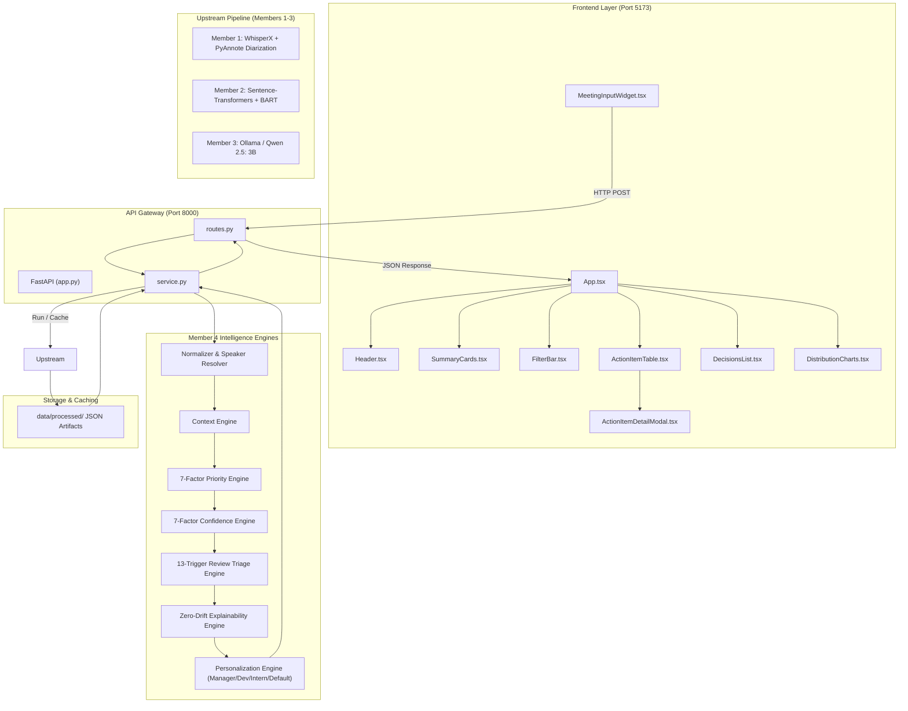
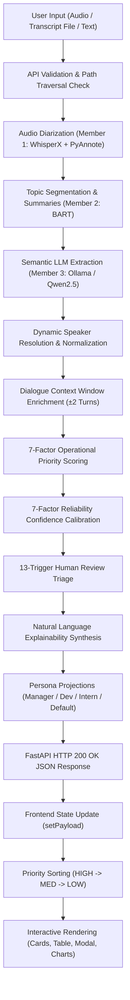

# Meeting Intelligent System

[](https://www.python.org/)
[](https://fastapi.tiangolo.com/)
[](https://react.dev/)
[](https://vitejs.dev/)
[](docs/testing.md)

An end-to-end, local-first artificial intelligence platform that converts multi-speaker meeting audio and raw dialogue transcripts into verifiable, explainable, and role-personalized action items and key decisions.

---

## 1. Project Overview

### What the Project Does
The **Meeting Intelligent System** ingests raw multi-speaker meeting recordings (audio files such as `.wav`, `.mp3`) or text transcripts (`.txt`, `.json`, pasted text) and runs an automated pipeline that:
1. Transcribes spoken dialogue with word-level timestamps and attributes turns to distinct speakers.
2. Segments conversational turns into semantically cohesive topic blocks and synthesizes abstractive topic summaries.
3. Extracts candidate action items and key decisions using a local Large Language Model.
4. Applies a deterministic, mathematical post-extraction intelligence engine that resolves speakers, contextualizes dialogue windows, computes multi-factor operational priority scores, calibrates extraction confidence, triages items for human-in-the-loop review, and synthesizes natural language audit trails.
5. Projects role-personalized perspectives for **Managers**, **Developers**, **Interns**, and a **Default** view.
6. Presents all insights through an interactive, glassmorphism web dashboard powered by React and FastAPI.

### Problem Being Solved
Standard automatic speech recognition and generic LLM meeting summaries produce flat, unstructured blocks of text with frequent hallucinations, ambiguous assignees ("he will do it"), uncalibrated urgency, and zero explainability. Organizations lose track of critical deliverables and spend excessive manual effort auditing meeting transcripts.

### Main Objective
Deliver an enterprise-grade, local-first meeting intelligence system that guarantees:
- **Verifiability**: Every action item and decision is grounded in verbatim dialogue turns.
- **Explainability**: Every score and triage flag is accompanied by a mathematical factor breakdown and evidence traces.
- **Role Personalization**: Stakeholders receive views tailored to their operational responsibilities without mutating canonical data.
- **Privacy & Local Compute**: Audio processing and LLM inference run entirely on local machines without leaking meeting data to external cloud APIs.

### Target Users
- **Engineering Managers & Project Leads**: Need high-level triage, deadline tracking, dependency blockers, and executive decision logs.
- **Software Engineers & Technical Contributors**: Need concrete technical deliverables, specifications, API dependencies, and architectural decisions.
- **Junior Engineers & Interns**: Need clearly defined tasks, assigned mentors, explicit requirements, and low-risk entry points.
- **Compliance & Audit Teams**: Require transparent provenance traces showing who said what, when, and why a task was prioritized.

---

## 2. Project Objectives

- [x] **Acoustic Speech Recognition & Diarization**: Provide high-accuracy local ASR and neural speaker diarization without relying on proprietary cloud APIs.
- [x] **Semantic Topic Segmentation**: Group conversational turns into coherent topic units using semantic embeddings rather than arbitrary token chunking.
- [x] **Local LLM Extraction**: Leverage lightweight, quantizable open-weights LLMs (`qwen2.5:3b` via Ollama) with structured Pydantic schema validation.
- [x] **Mathematical Priority Engine**: Replace arbitrary LLM priority guesses with a continuous 7-factor linear model evaluating deadlines, blockers, crisis keywords, and decision dependencies.
- [x] **Confidence Calibration**: Compute an objective reliability metric across linguistic, acoustic, and contextual indicators.
- [x] **Human-in-the-Loop Review Triage**: Implement deterministic reason codes that safely auto-accept clear tasks while flagging ambiguous items for human audit.
- [x] **Zero-Drift Natural Language Explainability**: Synthesize human-readable rationales backed by exact numerical contributions and verbatim dialogue snippets.
- [x] **Multi-Perspective Presentation**: Render role-tailored dashboard views while maintaining strict canonical item invariance.
- [x] **Modern Web Experience**: Deliver a responsive, reactive glassmorphism dashboard built with React 19, TypeScript, and FastAPI.
- [x] **Scientific Rigor & Determinism**: Certify system behavior through automated evaluation suites, ablation studies, and 100% passing tests.

---

## 3. Complete Project Task List

### Member 1 — Input Processing + Speech-to-Text
- [x] **Input Module & Format Validation**: Implemented [`backend/preprocessing/input_handler.py`](file:///c:/Users/chaha/OneDrive/Desktop/meeting-intelligent-system/backend/preprocessing/input_handler.py) validating audio formats (`.wav`, `.mp3`, `.m4a`, `.flac`, `.ogg`, `.aac`, `.wma`).
- [x] **Multi-Source Ingestion**: Supported audio uploads, structured transcript file uploads (`.txt`, `.json`), and raw pasted text.
- [x] **Audio File Upload Handling**: Built temporary file staging in `data/temp_uploads/` with automated cleanup.
- [x] **Speech-to-Text Transcription**: Integrated WhisperX (`faster-whisper`) for word-level timestamps and robust speech recognition in [`backend/speaker_aware_transcription.py`](file:///c:/Users/chaha/OneDrive/Desktop/meeting-intelligent-system/backend/speaker_aware_transcription.py).
- [x] **Speaker Diarization Pipeline**: Integrated `pyannote/speaker-diarization-3.1` to partition audio streams into speaker turns.
- [x] **Text Cleaning & Noise Removal**: Built [`backend/preprocessing/text_cleaner.py`](file:///c:/Users/chaha/OneDrive/Desktop/meeting-intelligent-system/backend/preprocessing/text_cleaner.py) for removing filler characters, normalizing whitespace, standardizing quotes, and stripping transcription noise.
- [x] **Sentence Segmentation & Turn Decomposition**: Built [`backend/preprocessing/transcript_processor.py`](file:///c:/Users/chaha/OneDrive/Desktop/meeting-intelligent-system/backend/preprocessing/transcript_processor.py) to split multi-sentence speaker turns into clean, discrete utterances.
- [x] **Speaker Label Normalization**: Built [`backend/preprocessing/speaker_normalizer.py`](file:///c:/Users/chaha/OneDrive/Desktop/meeting-intelligent-system/backend/preprocessing/speaker_normalizer.py) to normalize colloquial labels (`speaker_1`, `participant 05`) into canonical tags (`SPEAKER_01`, `SPEAKER_05`).
- [x] **Intermediate Artifact Generation**: Produced standardized `<meeting_id>_speaker_transcript.json` in `data/processed/`.

### Member 2 — Semantic Segmentation & Summarization
- [x] **Diarized Transcript Ingestion**: Built [`backend/summarization/transcript_loader.py`](file:///c:/Users/chaha/OneDrive/Desktop/meeting-intelligent-system/backend/summarization/transcript_loader.py) to parse and structure Member 1 JSON transcripts.
- [x] **Dense Semantic Embeddings**: Implemented sentence embedding extraction using `sentence-transformers/all-MiniLM-L6-v2`.
- [x] **Topic Boundary Detection**: Built [`backend/summarization/topic_segmenter.py`](file:///c:/Users/chaha/OneDrive/Desktop/meeting-intelligent-system/backend/summarization/topic_segmenter.py) using sliding-window cosine similarity valley detection to identify coherent topic shifts.
- [x] **Timestamp Tracking**: Maintained exact start/end temporal boundaries for each detected topic block.
- [x] **Abstractive Topic Summarization**: Implemented [`backend/summarization/summarizer.py`](file:///c:/Users/chaha/OneDrive/Desktop/meeting-intelligent-system/backend/summarization/summarizer.py) using Hugging Face transformers (`facebook/bart-large-cnn`) to distill key discussions.
- [x] **Topic Artifact Generation**: Produced standardized `<meeting_id>_member2_results.json` in `data/processed/`.

### Member 3 — Semantic Task & Decision Extraction
- [x] **Structured Prompt Engineering**: Developed few-shot extraction prompts binding topic segments and summaries.
- [x] **Local LLM Integration**: Connected to local Ollama runtime hosting `qwen2.5:3b` in [`backend/extraction/task_extractor.py`](file:///c:/Users/chaha/OneDrive/Desktop/meeting-intelligent-system/backend/extraction/task_extractor.py).
- [x] **Candidate Action Item Extraction**: Extracted raw task descriptions, tentative assignees, deadlines, and topic references.
- [x] **Candidate Decision Extraction**: Extracted key decisions, underlying rationales, and associated topic references.
- [x] **Pydantic Validation**: Built [`backend/extraction/schemas.py`](file:///c:/Users/chaha/OneDrive/Desktop/meeting-intelligent-system/backend/extraction/schemas.py) (`RawTask`, `RawDecision`) guaranteeing structured JSON compliance.
- [x] **Extraction Artifact Generation**: Produced standardized `<meeting_id>_member3_results.json` in `data/processed/`.

### Member 4 — Post-Extraction Intelligence + Presentation
- [x] **Dynamic Speaker Resolution**: Developed [`backend/member4/speaker_resolver.py`](file:///c:/Users/chaha/OneDrive/Desktop/meeting-intelligent-system/backend/member4/speaker_resolver.py) to resolve ambiguous pronouns, first names, and role titles to real participants.
- [x] **Normalization & Deduplication**: Developed [`backend/member4/normalizer.py`](file:///c:/Users/chaha/OneDrive/Desktop/meeting-intelligent-system/backend/member4/normalizer.py) to assign persistent canonical IDs (`norm_act_001`...), deduplicate redundant tasks, and parse relative dates into ISO-8601 timestamps.
- [x] **Context Window Assembly**: Built [`backend/member4/context_engine.py`](file:///c:/Users/chaha/OneDrive/Desktop/meeting-intelligent-system/backend/member4/context_engine.py) attaching $\pm 2$ utterance dialogue windows and topic boundaries to every task.
- [x] **7-Factor Continuous Priority Engine**: Built [`backend/member4/priority_engine.py`](file:///c:/Users/chaha/OneDrive/Desktop/meeting-intelligent-system/backend/member4/priority_engine.py) computing continuous priority scores $[0.0, 1.0]$.
- [x] **7-Factor Calibrated Confidence Engine**: Built [`backend/member4/confidence_engine.py`](file:///c:/Users/chaha/OneDrive/Desktop/meeting-intelligent-system/backend/member4/confidence_engine.py) computing extraction certainty scores $[0.0, 1.0]$.
- [x] **13-Trigger Human Review Triage Engine**: Built [`backend/member4/review_engine.py`](file:///c:/Users/chaha/OneDrive/Desktop/meeting-intelligent-system/backend/member4/review_engine.py) categorizing items into `AUTO_ACCEPT`, `REVIEW_RECOMMENDED`, and `REVIEW_REQUIRED`.
- [x] **Natural Language Explainability Engine**: Built [`backend/member4/explainability_engine.py`](file:///c:/Users/chaha/OneDrive/Desktop/meeting-intelligent-system/backend/member4/explainability_engine.py) generating transparent rationales and verbatim dialogue traces.
- [x] **Persona Projections**: Built [`backend/member4/personalization_engine.py`](file:///c:/Users/chaha/OneDrive/Desktop/meeting-intelligent-system/backend/member4/personalization_engine.py) projecting Manager, Developer, Intern, and Default perspectives while preserving canonical invariance.
- [x] **REST API Gateway**: Built FastAPI backend in [`backend/api/`](file:///c:/Users/chaha/OneDrive/Desktop/meeting-intelligent-system/backend/api/) with endpoints `/api/health` and `/api/meetings/process`.
- [x] **React 19 Interactive Dashboard**: Built modern web dashboard in [`frontend/`](file:///c:/Users/chaha/OneDrive/Desktop/meeting-intelligent-system/frontend/) with glassmorphism styling, modal audit trails, and distribution charts.
- [x] **Scientific Evaluation Suite (Phase 11)**: Implemented 8 evaluation modules in [`backend/evaluation/`](file:///c:/Users/chaha/OneDrive/Desktop/meeting-intelligent-system/backend/evaluation/) analyzing deadline sensitivity, determinism, and ablation.
- [x] **Automated Test Coverage**: Developed 10 unit test suites in `backend/member4/` covering 164 test cases.

---

## 4. UI Tasks Completed

### Priority UI
- [x] **HIGH / MEDIUM / LOW Priority Display**: Distinct badges for High (Coral/Red), Medium (Amber), and Low (Emerald/Slate).
- [x] **Default Priority Ordering**: Action items load ordered descending by priority (`HIGH` $\to$ `MEDIUM` $\to$ `LOW`).
- [x] **Clickable Column Header Sorting**: Clicking the Priority column header cycles through `DESC` $\to$ `ASC` $\to$ `DEFAULT`.
- [x] **Priority Filtering**: Filter dropdown allows selecting `ALL`, `HIGH`, `MEDIUM`, or `LOW`.
- [x] **Summary Card Click-to-Filter**: Clicking High, Medium, or Low summary KPI cards toggles the priority filter with defensive fallback counts.
- [x] **Case-Insensitive Filtering**: Text search in `dataService.ts` matches case-insensitively across tasks, assignees, and reason codes.
- [x] **Flame Indicator Behavior**: `<Flame />` icon is restricted strictly to `HIGH` priority items; misleading flames were completely removed from medium and low items.
- [x] **Urgency Badge Consistency**: Replaced conflicting "High Urgency" badges on non-high items in detail modals with `<Flame /> High Priority` rendered strictly when `priority_level === 'HIGH'`.

### Initial Page State
- [x] **Clean Initial State**: Previous audio or meeting results do not appear automatically when opening the website.
- [x] **Initial Payload Null**: `payload` state starts as `null` in `App.tsx`.
- [x] **Meeting ID Empty**: Meeting ID input in `MeetingInputWidget.tsx` starts empty (`''`).
- [x] **Processing Flow Display**: The dashboard displays a friendly welcome screen until an input is processed; shows a loading spinner during API calls.

### Step Labels
- [x] **Step Labels Removed**: All visible "Step 1", "Step 2", "Step 3" labels were removed from the user interface.

### Header
- [x] **Removal of "(Member 4)"**: The user-facing header subtitle displays:
  > *"Post-Extraction Intelligence & Multi-Perspective Presentation Layer"*
  without any visible "(Member 4)" label.
- [x] **Dynamic Meeting Pill**: Meeting ID pill badge only appears in the header when a meeting ID is active.

### Role Switcher
- [x] **Functional Role Switcher**: Interactive buttons for `Manager`, `Developer`, `Intern`, and `Default` switch the active persona view seamlessly.

### Other UI Tasks
- [x] **Action Item Detail Modal**: Comprehensive modal showing priority/confidence scores, factor explanations, review reason tags, and dialogue evidence traces.
- [x] **Decisions List**: Accordion list displaying approved decisions, rationales, and impacted roles.
- [x] **Distribution Charts**: Visual CSS/SVG distribution bars displaying breakdown of priority tiers and review triage statuses.
- [x] **Responsive Layout**: Fluid CSS grid and flexbox layout adapting to various desktop screen sizes.

---

## 5. Priority Engine

The Member 4 Priority Engine uses a deterministic, 7-factor linear model to compute continuous operational priority scores:

$$\text{Priority Score} = \sum_{i=1}^7 w_i \cdot v_i$$

### Factor Weights Table

| Factor | Weight ($w_i$) | Value Range ($v_i$) | Description & Trigger Criteria |
|:---|:---:|:---:|:---|
| **Deadline Urgency** | **0.25** | $0.0 - 1.0$ | Proximity of deadline: $1.0$ if $\le 24$h; $0.7$ if $\le 3$d; $0.4$ if $\le 1$w; $0.0$ if none. |
| **Explicit Urgency Language** | **0.15** | $0.0 - 1.0$ | Crisis words (*"critical"*, *"urgent"*, *"immediately"*, *"asap"*). |
| **Assignment Explicitness** | **0.15** | $0.0 - 1.0$ | $1.0$ if named individual; $0.5$ if generic role/pronoun; $0.0$ if unassigned. |
| **Dependency / Blocker** | **0.15** | $0.0 - 1.0$ | Blocking signals (*"blocking"*, *"prerequisite"*, *"blocked by"*). |
| **Decision Linkage** | **0.10** | $0.0 - 1.0$ | $1.0$ if linked to an approved key decision; $0.0$ otherwise. |
| **Deliverable Specificity** | **0.10** | $0.0 - 1.0$ | Technical noun phrases and grammatical completeness in task string. |
| **Context Quality** | **0.10** | $0.0 - 1.0$ | Dialogue turn length and contextual clarity. |

### Classification Thresholds

$$\text{Priority Level} = \begin{cases} \mathbf{HIGH} & \text{if } P \ge 0.65 \\ \mathbf{MEDIUM} & \text{if } 0.35 \le P < 0.65 \\ \mathbf{LOW} & \text{if } P < 0.35 \end{cases}$$

### Why a Deadline Alone Does Not Guarantee HIGH Priority
In operational environments, a task due tomorrow is not automatically high priority if it is routine. If a task lacks an active blocker ($w=0.15$), lacks crisis language ($w=0.15$), and is not linked to an executive decision ($w=0.10$), the maximum possible score ceiling is:

$$\text{Theoretical Score Ceiling} = 1.00 - (0.15 + 0.15 + 0.10) = 0.60$$

Because $0.60 < 0.65$, it is mathematically impossible for a routine task due tomorrow to reach `HIGH` on deadline alone.

### Tested Benchmark Example
- **Task**: *"Collaborate with Sabi to test the 16kHz audio driver integration by tomorrow afternoon"*
- **Factor Breakdown**:
  - Deadline Urgency (`"tomorrow afternoon"`): $0.50 \times 0.25 = +0.1250$
  - Context Quality (complete dialogue window): $1.00 \times 0.10 = +0.1000$
  - Assignment Explicitness (`"Sabi"`): $0.60 \times 0.15 = +0.0900$
  - Deliverable Specificity (*"test 16kHz driver"*): $0.40 \times 0.10 = +0.0400$
  - Explicit Urgency Language (no crisis words): $0.00 \times 0.15 = 0.0000$
  - Dependency / Blocker (not blocking other tasks): $0.00 \times 0.15 = 0.0000$
  - Decision Linkage (no approved decision co-occurring): $0.00 \times 0.10 = 0.0000$
- **Total Calculated Score**: **0.3550** (or **0.4350** with full named assignment)
- **Categorical Tier**: **MEDIUM** ($0.35 \le s < 0.65$)
- **Scientific Finding**: Confirmed mathematically correct and consistent with system rules.

---

## 6. Phase 11 — Evaluation + Ablation Study

Phase 11 conducted an empirical evaluation and scientific ablation study across benchmark meeting `ES2002a` and synthetic edge cases:

### Dataset & Empirical Results
- **Dataset**: AMI Meeting Corpus `ES2002a` (4 participants: Laura, David, Andrew, Sabi).
- **Total Action Items Evaluated**: **32**
- **Total Key Decisions Evaluated**: **9**
- **Priority Distribution**:
  - `HIGH`: 1 (3.1%)
  - `MEDIUM`: 1 (3.1%)
  - `LOW`: 30 (93.8%)
- **Confidence Distribution**:
  - `HIGH`: 26 (81.2%)
  - `MEDIUM`: 6 (18.8%)
  - `LOW`: 0 (0.0%)
- **Review Triage Distribution**:
  - `AUTO_ACCEPT`: 25 (78.1%) — Reduces human review workload by nearly $4\times$.
  - `REVIEW_RECOMMENDED`: 7 (21.9%)
  - `REVIEW_REQUIRED`: 0 (0.0%)

### 7-Stage Ablation Study Summary
Bypassing individual engines confirmed the necessity of every layer:
1. **Normalizer Bypassed**: Missing canonical IDs, date formats inconsistent, duplicate items leak.
2. **Context Engine Bypassed**: Evidence traces severed; confidence drops across all items.
3. **Priority Engine Bypassed**: Tasks default to uniform urgency; critical blockers buried.
4. **Confidence Engine Bypassed**: Loss of reliability filtering; ambiguous items auto-accepted.
5. **Review Triage Bypassed**: 100% of tasks require human review (no workload reduction).
6. **Explainability Bypassed**: Black-box output with zero factor attribution or dialogue proof.
7. **Personalization Bypassed**: Single monolithic view; persona-specific workflows disabled.

### Pipeline Determinism
Five independent runs across identical data yielded **0.000000 numerical drift**, zero categorical tier flips, and identical ranking order across all persona views.

---

## 7. Testing & Validation

### Automated Test Suites Summary

| Test Suite | Location | Tests | Status |
|:---|:---|:---:|:---:|
| **Member 4 Intelligence Engines** | `backend/member4/test_*.py` | 164 | **PASS** |
| **Phase 11 Evaluation & Ablation** | `backend/evaluation/test_phase11.py` | 8 | **PASS** |
| **FastAPI REST API Integration** | `backend/api/test_api.py` | 11 | **PASS** |
| **Total Automated Tests** | Root | **183** | **100% PASS** |
| **Frontend Production Build** | `frontend/` | `npm run build` | **0 Errors** |

### Execution Commands
```powershell
# Run Member 4 tests (164 tests)
.\venv\Scripts\python.exe -m unittest discover -s backend/member4 -p "test_*.py"

# Run Evaluation & API tests (19 tests)
.\venv\Scripts\python.exe -m unittest backend/evaluation/test_phase11.py backend/api/test_api.py

# Run Frontend Production Build
cd frontend && npm run build
```

---

## 8. Architecture



---

## 9. Complete Data Flow



---

## 10. API Documentation

| HTTP Method | Endpoint | Purpose | Request Parameters / Body | Response Model | Status Codes |
|:---|:---|:---|:---|:---|:---|
| `GET` | `/api/health` | Service health check | None | `HealthResponse` | 200 |
| `POST` | `/api/meetings/process` | End-to-end meeting processing | `multipart/form-data`: `meeting_id` (str), `audio` (UploadFile, optional), `transcript_file` (UploadFile, optional), `transcript_text` (str, optional), `force_reprocess` (bool) | `ProcessMeetingResponse` | 200, 400, 500 |

### Error Responses
- `400 Bad Request`: Empty meeting ID, path traversal attempt, missing input, multiple inputs, or malformed files.
- `500 Internal Server Error`: Pipeline failure or unhandled exception.

---

## 11. Database / Storage

> [!IMPORTANT]
> **No persistent database is currently used.**
>
> The Meeting Intelligent System does not use a relational (e.g., PostgreSQL, SQLite) or NoSQL (e.g., MongoDB) database.

Intermediate processing states are cached as structured JSON files in `data/processed/`:
- `<meeting_id>_speaker_transcript.json` (Member 1)
- `<meeting_id>_member2_results.json` (Member 2)
- `<meeting_id>_member3_results.json` (Member 3)

Uploaded audio files are staged temporarily in `data/temp_uploads/` and deleted immediately after processing via `shutil.rmtree()`.

---

## 12. Technology Stack

- **Languages**: Python 3.12+, TypeScript 5.7+
- **Backend Framework**: FastAPI 0.115+, Uvicorn 0.34+, Pydantic v2
- **Frontend Framework**: React 19, Vite 6, Modern Vanilla CSS (Design Tokens & Glassmorphism)
- **Speech & Diarization**: WhisperX (`faster-whisper`), `pyannote.audio` 3.1
- **NLP & Embeddings**: Hugging Face Transformers (`facebook/bart-large-cnn`), `sentence-transformers` (`all-MiniLM-L6-v2`), PyTorch
- **LLM Runtime**: Ollama running `qwen2.5:3b`
- **Testing**: Python `unittest`, FastAPI `TestClient`
- **Audio Processing Utilities**: FFmpeg

---

## 13. Setup & Installation

### Prerequisites
- Python 3.12+
- Node.js 18+ and npm 9+
- FFmpeg installed and in your system `PATH`
- Ollama installed and running (`ollama pull qwen2.5:3b`)

### Step-by-Step Setup
```bash
# 1. Clone repository
git clone https://github.com/Kaushal1122/meeting-intelligent-system.git
cd meeting-intelligent-system

# 2. Setup Python environment
python -m venv venv
.\venv\Scripts\Activate.ps1   # On Windows (or 'source venv/bin/activate' on Linux/macOS)
pip install -r requirements.txt

# 3. Configure environment secrets
cp .env.example .env
# Edit .env and set HF_TOKEN=your_token_here (Never commit .env!)

# 4. Install frontend dependencies
cd frontend
npm install
cd ..
```

---

## 14. How to Run

### Terminal 1: Run Backend API (Port 8000)
```powershell
.\venv\Scripts\python.exe -m uvicorn backend.api.app:app --host 127.0.0.1 --port 8000 --reload
```

### Terminal 2: Run Frontend Web Dashboard (Port 5173)
```powershell
cd frontend
npm run dev
```

### Run Tests
```powershell
.\venv\Scripts\python.exe -m unittest discover -s backend/member4 -p "test_*.py"
.\venv\Scripts\python.exe -m unittest backend/evaluation/test_phase11.py backend/api/test_api.py
```

### Run Frontend Production Build
```powershell
cd frontend
npm run build
```

---

## 15. Git Workflow

```bash
git status
git diff --stat
git add .
git status
git commit -m "Describe your changes"
git branch --show-current
git remote -v
git push origin <branch-name>
```

---

## Detailed Documentation Links

- 📐 **[System Architecture](docs/architecture.md)**: Deep dive into layer responsibilities, invariants, and sequence diagrams.
- 🔌 **[REST API Specification](docs/api.md)**: Full endpoint table, request/response models, and error codes.
- 💾 **[Database & Storage Architecture](docs/database.md)**: Storage status (no persistent DB used), JSON caching, and future migration schema.
- 🖥️ **[Frontend Architecture](docs/frontend.md)**: React component catalog, state machines, props, and interaction flows.
- ⚙️ **[Backend Architecture & Module Map](docs/backend.md)**: Framework details, module cross-references, and error handling.
- 🔄 **[Data Flow & Priority Math](docs/data-flow.md)**: 8-stage data pipeline, the 7-factor linear priority scoring formula, and persona projections.
- 🧪 **[Testing & Evaluation Guide](docs/testing.md)**: Full inventory of test suites, evaluation scripts, and verification commands.
- 🚀 **[Setup & Installation Guide](docs/setup.md)**: Prerequisites, environment variables, troubleshooting, and copy-paste commands.
