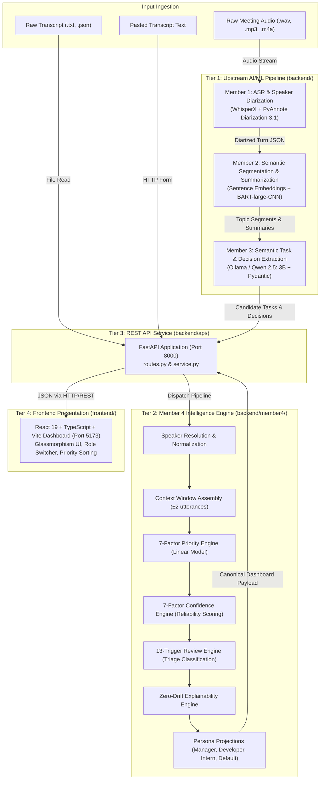
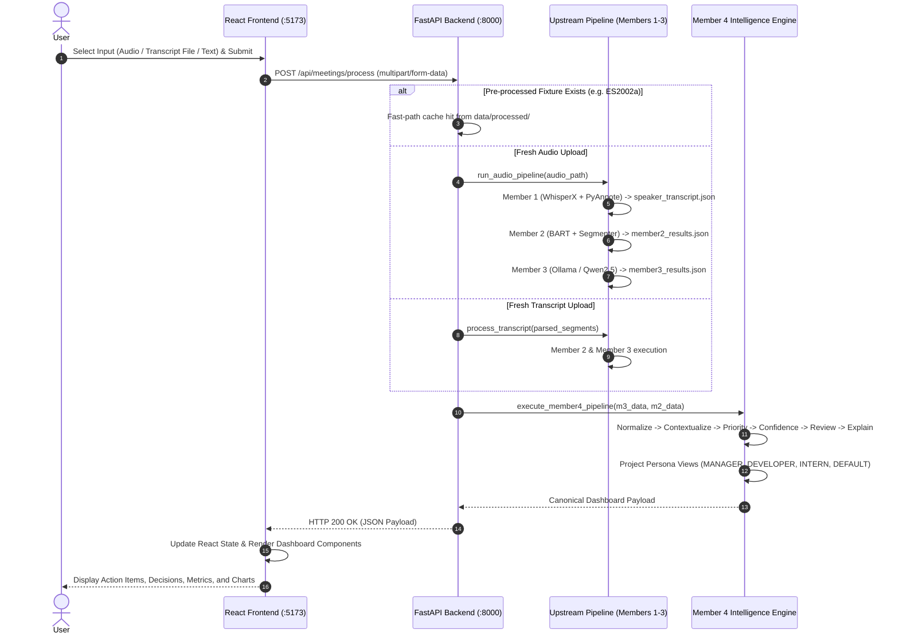

# Meeting Intelligent System — Architecture Documentation

## 1. System Overview

The **Meeting Intelligent System** is a local-first, high-precision meeting intelligence and operational triage platform. It takes multi-speaker meeting audio or raw dialogue transcripts and transforms them into verifiable, explainable, and role-personalized action items and key decisions.

The architecture decouples upstream speech recognition, topic clustering, and LLM extraction from a deterministic post-extraction intelligence engine and a reactive, glassmorphism web dashboard.

---

## 2. Architectural Design Principles

1. **Strict Upstream-Downstream Decoupling**:
   - Members 1–3 perform stochastic, deep-learning-based perception (speech recognition, diarization, neural summarization, and LLM text generation).
   - Member 4 is completely deterministic and mathematical. It executes calibration, priority scoring, confidence assessment, explainability generation, and role projection without non-deterministic LLM hallucinations.
2. **Canonical Invariance**:
   - The canonical set of action items and decisions is established once during normalization.
   - Role switching (`MANAGER`, `DEVELOPER`, `INTERN`, `DEFAULT`) projects different view filters, ranking weights, and role-specific summaries, but **never mutates** the underlying canonical item IDs, base priority scores, confidence scores, or raw dialogue evidence.
3. **Orthogonality of Priority and Confidence**:
   - **Priority** measures the operational urgency and systemic impact of a task (e.g., deadlines, blockers, decision dependencies).
   - **Confidence** measures the linguistic and perceptual certainty of the extraction (e.g., explicit grammatical structure, clear speaker attribution, acoustic agreement).
   - An item can be **High Priority** but **Low Confidence** (urgent command muttered indistinctly), requiring human review. Conversely, an item can be **Low Priority** but **High Confidence** (routine observation stated clearly).
4. **Zero-Drift Explainability**:
   - Every score and triage flag produced by the system includes an exact breakdown of contributing factor weights and verbatim dialogue provenance (`evidence_traces`) linking directly back to transcript utterances.
5. **Local-First & Privacy-Centric Execution**:
   - Acoustic processing and LLM inference run entirely on local compute via WhisperX, PyAnnote, and Ollama (`qwen2.5:3b`). No external proprietary APIs are called during processing.

---

## 3. Layer Breakdown & Responsibilities

### Layer 1: Ingestion & Preprocessing (`backend/preprocessing/`)
- **Modules**:
  - `input_handler.py`: Validates audio formats (`.wav`, `.mp3`, `.m4a`, `.flac`, `.ogg`, `.aac`, `.wma`) and checks file paths.
  - `text_cleaner.py`: Strips non-standard punctuation, normalizes whitespace, cleans dialogue tokens.
  - `speaker_normalizer.py`: Maps colloquial speaker references (`speaker_1`, `participant 05`) to canonical tags (`SPEAKER_01`, `SPEAKER_05`).
  - `transcript_processor.py`: Parses timestamped, speaker-attributed raw text files and decomposes turns into clean sentences.

### Layer 2: Speech & Diarization (`backend/speaker_aware_transcription.py`)
- **Technologies**: WhisperX (`faster-whisper`), PyAnnote.audio (`pyannote/speaker-diarization-3.1`).
- **Function**: Reads raw audio, detects active speech intervals, computes speaker embedding centroids, and aligns transcribed text tokens to temporal speaker turns.
- **Output Artifact**: `<meeting_id>_speaker_transcript.json`.

### Layer 3: Topic Segmentation & Summarization (`backend/summarization/`)
- **Technologies**: Hugging Face Transformers (`facebook/bart-large-cnn`), Sentence-Transformers (`all-MiniLM-L6-v2`), PyTorch.
- **Function**: Computes semantic embedding vectors across consecutive turns, detects topic boundaries via cosine similarity valleys, and generates abstractive summaries for each discrete meeting phase.
- **Output Artifact**: `<meeting_id>_member2_results.json`.

### Layer 4: Semantic Information Extraction (`backend/extraction/`)
- **Technologies**: Ollama runtime running `qwen2.5:3b`, Pydantic schema validation.
- **Function**: Passes structured topic transcripts with few-shot instructions into the local LLM to extract candidate action items (task, responsible person, deadline) and candidate key decisions.
- **Output Artifact**: `<meeting_id>_member3_results.json`.

### Layer 5: Post-Extraction Intelligence Engine (`backend/member4/`)
- **Technologies**: Python 3.12, Pydantic v2.
- **Engines**:
  - `speaker_resolver.py`: Matches ambiguous names, nicknames, and role titles against real meeting participants.
  - `normalizer.py`: Deduplicates items, assigns persistent IDs (`norm_act_001`...), parses relative deadlines into ISO dates.
  - `context_engine.py`: Binds upstream topic boundaries and $\pm 2$ utterance dialogue context windows to each task.
  - `priority_engine.py`: Evaluates a 7-factor linear model producing a continuous priority score $[0.0, 1.0]$ and categorizes into `HIGH` ($\ge 0.65$), `MEDIUM` ($\ge 0.35$), or `LOW` ($< 0.35$).
  - `confidence_engine.py`: Evaluates 7 reliability metrics to calculate an extraction confidence score $[0.0, 1.0]$.
  - `review_engine.py`: Inspects 13 deterministic heuristics to tag items as `AUTO_ACCEPT`, `REVIEW_RECOMMENDED`, or `REVIEW_REQUIRED`.
  - `explainability_engine.py`: Synthesizes human-readable factor rationales and verbatim dialogue snippets.
  - `personalization_engine.py`: Projects persona-specific lenses (`MANAGER`, `DEVELOPER`, `INTERN`, `DEFAULT`) with customized sorting and focus metrics.

### Layer 6: API Layer (`backend/api/`)
- **Technologies**: FastAPI, Starlette, Uvicorn, Python-Multipart.
- **Function**: Exposes REST endpoints (`GET /api/health`, `POST /api/meetings/process`), handles multipart file uploads (audio files, transcript files) and text payloads, enforces input exclusivity, and returns the complete Member 4 dashboard payload.

### Layer 7: Presentation Layer (`frontend/`)
- **Technologies**: React 19, TypeScript, Vite, Vanilla CSS.
- **Function**: Renders an interactive glassmorphism dashboard with zero external UI bloat. Features include initial clean empty-state greeting, role switching, client-side priority sorting, card click-to-filter, action item detail modal with full evidence traces, and distribution charts.

---

## 4. Communication & Data Flow Sequence

---

## 5. Architectural Invariants & Security Posture

- **Security & Secret Protection**:
  - `HF_TOKEN` is used strictly on the server side to pull the PyAnnote speaker diarization model.
  - The API explicitly filters out all environment variables and secrets; `HF_TOKEN` is never sent over the network to the frontend.
- **Path Traversal Mitigation**:
  - `meeting_id` input parameters are sanitized with strict regex `^[A-Za-z0-9_\-]+$`. Any path traversal characters (`..`, `/`, `\`) trigger an immediate HTTP 400 rejection.
- **Deterministic Repeatability**:
  - Given identical upstream Member 3 JSON and Member 2 topic summaries, Member 4 produces bit-for-bit identical scores, classifications, reason codes, and natural language explanations every single time.
