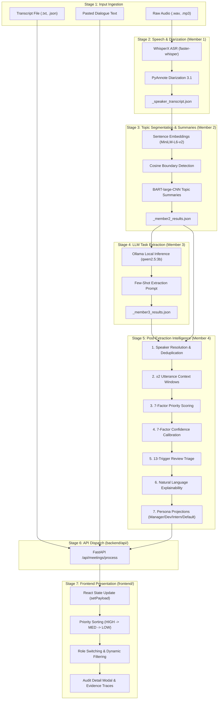

# Meeting Intelligent System — Data Flow & Processing Pipeline

## 1. End-to-End System Execution Flow

The system processes meeting communication data across an 8-stage transformation pipeline from raw acoustic or textual inputs to interactive UI rendering:

---

## 2. Detailed Pipeline Stage Breakdown

### Stage 1: Input Ingestion & Sanitization
- **Responsible Modules**: [`backend/preprocessing/input_handler.py`](file:///c:/Users/chaha/OneDrive/Desktop/meeting-intelligent-system/backend/preprocessing/input_handler.py), [`backend/api/service.py`](file:///c:/Users/chaha/OneDrive/Desktop/meeting-intelligent-system/backend/api/service.py)
- **Input**: Raw audio file (`.wav`, `.mp3`), transcript file (`.txt`, `.json`), or raw pasted text.
- **Processing**:
  1. Validates `meeting_id` against safe alphanumeric regex (`^[A-Za-z0-9_\-]+$`) to prevent path traversal attacks.
  2. Enforces input exclusivity: exactly one input source is permitted.
  3. Formats text turns into structured segment lists with speaker labels and clean sentence splits.
- **Output**: Clean in-memory dictionary of segments or staging file in `data/temp_uploads/`.

### Stage 2: Audio Transcription & Speaker Diarization (Member 1)
- **Responsible Modules**: [`backend/speaker_aware_transcription.py`](file:///c:/Users/chaha/OneDrive/Desktop/meeting-intelligent-system/backend/speaker_aware_transcription.py)
- **Input**: Multi-speaker meeting audio.
- **Processing**:
  1. Executes WhisperX automatic speech recognition for high-accuracy token timestamps.
  2. Applies PyAnnote.audio 3.1 neural speaker diarization clustering.
  3. Aligns transcribed words to speaker turns using temporal intersection.
- **Output**: `<meeting_id>_speaker_transcript.json` with timestamped turns.

### Stage 3: Semantic Segmentation & Summarization (Member 2)
- **Responsible Modules**: [`backend/summarization/topic_segmenter.py`](file:///c:/Users/chaha/OneDrive/Desktop/meeting-intelligent-system/backend/summarization/topic_segmenter.py), [`backend/summarization/summarizer.py`](file:///c:/Users/chaha/OneDrive/Desktop/meeting-intelligent-system/backend/summarization/summarizer.py)
- **Input**: Diarized speaker turns from Member 1.
- **Processing**:
  1. Computes dense sentence embeddings using `sentence-transformers/all-MiniLM-L6-v2`.
  2. Calculates sliding-window cosine similarity scores to detect topic shift boundaries (valleys).
  3. Groups turns into discrete topic blocks.
  4. Passes topic text to `facebook/bart-large-cnn` to synthesize concise, abstractive summaries.
- **Output**: `<meeting_id>_member2_results.json`.

### Stage 4: Semantic Task & Decision Extraction (Member 3)
- **Responsible Modules**: [`backend/extraction/task_extractor.py`](file:///c:/Users/chaha/OneDrive/Desktop/meeting-intelligent-system/backend/extraction/task_extractor.py)
- **Input**: Topic-segmented transcript from Member 2.
- **Processing**:
  1. Constructs a prompt containing topic context, turn transcripts, and strict extraction instructions.
  2. Sends request to local Ollama daemon hosting `qwen2.5:3b`.
  3. Parses returned JSON containing raw action items (task, assignee, deadline, topic reference) and candidate key decisions.
- **Output**: `<meeting_id>_member3_results.json`.

### Stage 5: Post-Extraction Intelligence Layer (Member 4)
- **Responsible Modules**: [`backend/member4/`](file:///c:/Users/chaha/OneDrive/Desktop/meeting-intelligent-system/backend/member4/)
- **Sub-engines**:
  1. **Speaker Resolution**: Matches pronouns and informal mentions to canonical meeting participants.
  2. **Normalization**: Assigns stable IDs (`norm_act_001`...), parses dates into ISO-8601 strings.
  3. **Context Enrichment**: Attaches $\pm 2$ utterance dialogue windows and topic boundaries.
  4. **Priority Engine**: Computes continuous urgency score via 7-factor linear model.
  5. **Confidence Engine**: Computes extraction reliability score across 7 acoustic/linguistic dimensions.
  6. **Review Engine**: Evaluates 13 deterministic triggers to classify review status.
  7. **Explainability Engine**: Compiles natural language factor rationales and dialogue provenance traces.
  8. **Personalization Engine**: Projects role-tailored views for `MANAGER`, `DEVELOPER`, `INTERN`, and `DEFAULT`.
- **Output**: `Member4DashboardPayload`.

### Stage 6: REST API Dispatch
- **Responsible Modules**: [`backend/api/routes.py`](file:///c:/Users/chaha/OneDrive/Desktop/meeting-intelligent-system/backend/api/routes.py)
- **Processing**: Serializes Pydantic payload to JSON, verifies no secret leakage, returns HTTP 200 OK.

### Stage 7: Frontend Presentation & Interaction
- **Responsible Modules**: [`frontend/src/App.tsx`](file:///c:/Users/chaha/OneDrive/Desktop/meeting-intelligent-system/frontend/src/App.tsx)
- **Processing**:
  1. Updates global React state `payload` from `null` to active meeting data.
  2. Sorts action items descending by priority (`HIGH` $\to$ `MEDIUM` $\to$ `LOW`).
  3. Renders Summary KPI cards with click-to-filter capability.
  4. Updates UI when persona role is switched.
  5. Opens `ActionItemDetailModal` upon row click to display complete audit trail and dialogue evidence.

---

## 3. The 7-Factor Urgency & Priority Model

The system calculates priority score $P \in [0.0, 1.0]$ using a linear multi-factor combination:

$$P = \sum_{i=1}^7 w_i \cdot v_i$$

### Factor Weights and Criteria

| Factor ($i$) | Weight ($w_i$) | Value Range ($v_i$) | Description & Trigger Criteria |
|:---|:---:|:---:|:---|
| **Deadline Urgency** | $0.25$ | $0.0 - 1.0$ | Proximity of deadline: $1.0$ if due within 24h; $0.7$ if due within 3 days; $0.4$ if due within 1 week; $0.0$ if no deadline. |
| **Explicit Urgency Language** | $0.15$ | $0.0 - 1.0$ | Triggered by crisis keywords: *"immediately"*, *"urgent"*, *"critical"*, *"asap"*, *"highest priority"*. |
| **Assignment Explicitness** | $0.15$ | $0.0 - 1.0$ | $1.0$ if assignee is explicitly named; $0.5$ if generic role/pronoun; $0.0$ if unassigned. |
| **Dependency Blocker** | $0.15$ | $0.0 - 1.0$ | Triggered by dependency signals: *"blocking"*, *"prerequisite"*, *"blocked by"*, *"depends on"*. |
| **Decision Linkage** | $0.10$ | $0.0 - 1.0$ | $1.0$ if task implements an approved Key Decision from the meeting; $0.0$ otherwise. |
| **Deliverable Specificity** | $0.10$ | $0.0 - 1.0$ | Length, grammatical completeness, and concrete technical noun phrases in task description. |
| **Context Quality** | $0.10$ | $0.0 - 1.0$ | Utterance turn length, speaker status, and contextual dialogue clarity. |

### Classification Thresholds

$$\text{Priority Level} = \begin{cases} \mathbf{HIGH} & \text{if } P \ge 0.65 \\ \mathbf{MEDIUM} & \text{if } 0.35 \le P < 0.65 \\ \mathbf{LOW} & \text{if } P < 0.35 \end{cases}$$

### Why a Task Due "Tomorrow" May Correctly Be Classified as `MEDIUM`
Consider an action item such as:
> *"Collaborate with Sabi to test the 16kHz audio driver integration by tomorrow afternoon"*
- **Deadline Urgency**: $+0.25 \times 1.0 = 0.25$
- **Assignment Explicitness**: $+0.15 \times 1.0 = 0.15$ (explicit collaborator)
- **Deliverable Specificity**: $+0.10 \times 0.35 = 0.035$
- **Explicit Urgency Language**: $0.0$ (no crisis words like "critical" or "urgent")
- **Dependency Blocker**: $0.0$ (not flagged as blocking other features)
- **Decision Linkage**: $0.0$ (not linked to an approved key decision)
- **Total Score**: $0.25 + 0.15 + 0.035 = \mathbf{0.4350}$

Because $0.4350$ falls in the interval $[0.35, 0.65)$, the item is **mathematically and correctly classified as MEDIUM**. To reach `HIGH` ($\ge 0.65$), a task must possess multiple compounding factors—such as being a critical blocker on other team members or implementing an urgent executive decision.

---

## 4. Role-Specific Personalization Mechanics

When switching between roles in the dashboard, the canonical items remain unchanged, but the presentation adapts dynamically:

| Feature | `MANAGER` Role | `DEVELOPER` Role | `INTERN` Role | `DEFAULT` Role |
|:---|:---|:---|:---|:---|
| **Primary Focus** | Deadlines, blockers, executive decisions, resource allocation. | Technical deliverables, APIs, dependencies, concrete specs. | Explicit tasks, assigned mentors, clear acceptance criteria. | Unfiltered canonical baseline. |
| **Ranking Order** | Blockers $\to$ High Priority $\to$ Imminent Deadlines. | Technical Tasks $\to$ High Priority $\to$ Medium Priority. | Low-Risk Tasks $\to$ Assigned Mentors $\to$ Detailed Instructions. | Pure Priority Score ($P$ descending). |
| **Badges & Visuals** | "Executive Focus", "Urgent Blocker". | "API Dependency", "Tech Deliverable". | "Mentorship Required", "Entry Task". | Standard Priority Badge. |
| **Item Multiplier** | Boosts decision-linked items by $\times 1.2$. | Boosts technical/spec items by $\times 1.2$. | Boosts high-confidence, non-blocking items by $\times 1.1$. | Neutral ($\times 1.0$). |
| **Item Count Invariance** | 32 Canonical Items visible. | 32 Canonical Items visible. | 32 Canonical Items visible. | 32 Canonical Items visible. |
