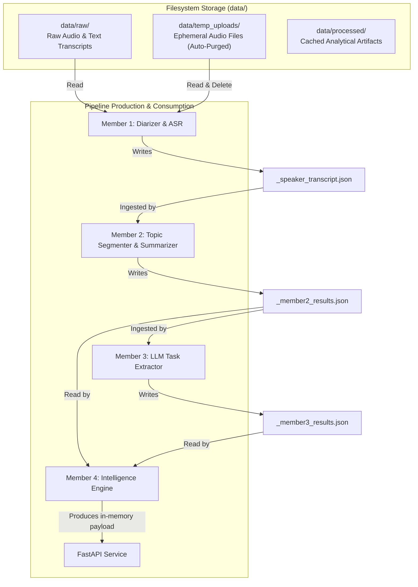
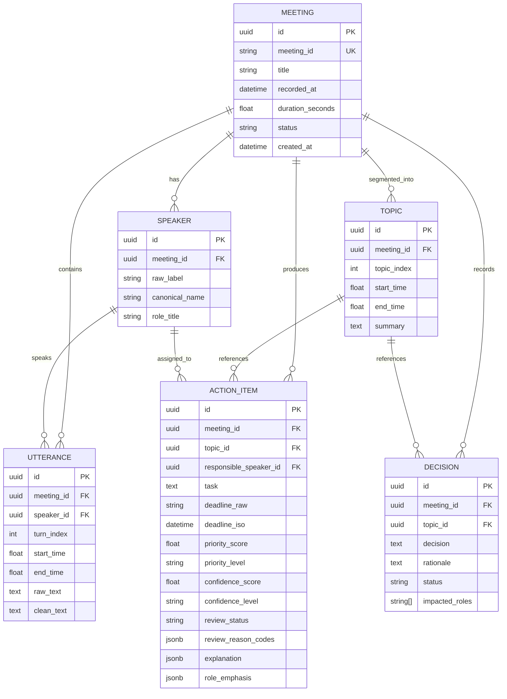

# Meeting Intelligent System — Database & Storage Architecture

## 1. Database Status

> [!IMPORTANT]
> **No persistent database is currently used.**
>
> The Meeting Intelligent System does not use a relational (e.g., PostgreSQL, MySQL, SQLite) or NoSQL (e.g., MongoDB, DynamoDB) persistent database.

---

## 2. Actual Storage & Caching Architecture

The application implements a **local-first, file-based pipeline architecture**. It stores and shares intermediate processing states via structured JSON artifacts persisted in the local filesystem directory:

```
meeting-intelligent-system/
└── data/
    ├── ami/                   # Benchmark corpus (audio + annotation ground truth)
    ├── raw/                   # Unprocessed meeting inputs (.wav, .txt)
    ├── temp_uploads/          # Ephemeral directory for API audio uploads (auto-cleaned)
    └── processed/             # Cached JSON pipeline artifacts
```



---

## 3. Persistent JSON File Artifacts Schema

The pipeline produces three core JSON artifacts in `data/processed/` for each processed meeting:

### 3.1 Member 1 Output: `<meeting_id>_speaker_transcript.json`
Stores the time-aligned, speaker-attributed dialogue turns produced by WhisperX and PyAnnote.

```json
{
  "meeting_id": "ES2002a",
  "language": "en",
  "source": "audio",
  "segments": [
    {
      "segment_id": 1,
      "speaker": "SPEAKER_00",
      "start": 12.45,
      "end": 15.80,
      "raw_text": "Okay, let's start the project kickoff meeting.",
      "clean_text": "Okay, let's start the project kickoff meeting."
    }
  ]
}
```

### 3.2 Member 2 Output: `<meeting_id>_member2_results.json`
Stores clustered topic segments with boundary timestamps and BART-generated abstractive summaries.

```json
{
  "meeting_id": "ES2002a",
  "total_topics": 42,
  "topics": [
    {
      "topic_id": 4,
      "start_time": 180.2,
      "end_time": 340.5,
      "summary": "The team discussed industrial casing requirements, settling on rubberized grips for ergonomics.",
      "segments": [
        { "segment_id": 22, "speaker": "SPEAKER_01", "text": "We should use rubberized grips." }
      ]
    }
  ]
}
```

### 3.3 Member 3 Output: `<meeting_id>_member3_results.json`
Stores raw extracted candidate action items and candidate key decisions generated by Ollama (`qwen2.5:3b`).

```json
{
  "meeting_id": "ES2002a",
  "action_items": [
    {
      "task": "Develop the functional remote-control prototype",
      "responsible_person": "Industrial Designer",
      "deadline": "Tomorrow 5 PM",
      "topic_reference": 40,
      "needs_human_review": false,
      "confidence": 0.85
    }
  ],
  "key_decisions": [
    {
      "decision": "Adopt double-curved yellow casing with rubberized grips",
      "rationale": "Superior ergonomics rating in user research",
      "topic_reference": 4
    }
  ]
}
```

---

## 4. Data Lifecycle & Cache Validation

1. **Idempotency & Fast-Path Retrieval**:
   - When the user processes meeting `ES2002a` (or any existing meeting) and `force_reprocess=False`, the backend checks if `data/processed/<meeting_id>_member3_results.json` and `<meeting_id>_member2_results.json` exist.
   - If present, upstream audio transcription and LLM inference are skipped, returning results in `< 100ms`.
2. **Ephemeral File Handling**:
   - Audio files uploaded via the `/api/meetings/process` endpoint are temporarily staged in `data/temp_uploads/audio_upload_<uuid>/`.
   - The file is processed, and the temporary folder is deleted inside a `finally:` block via `shutil.rmtree()`, ensuring zero unmonitored disk bloat.
3. **Data Immutability**:
   - Upstream JSON artifacts are write-once during pipeline runs.
   - Member 4 loads these artifacts in read-only mode, guaranteeing that raw historical extractions are never overwritten.

---

## 5. Future-State Database Migration Plan (Optional Proposal)

If the platform requires multi-tenant persistent storage, user accounts, and historical audit logs in the future, the following relational schema is recommended for PostgreSQL / SQLite:


