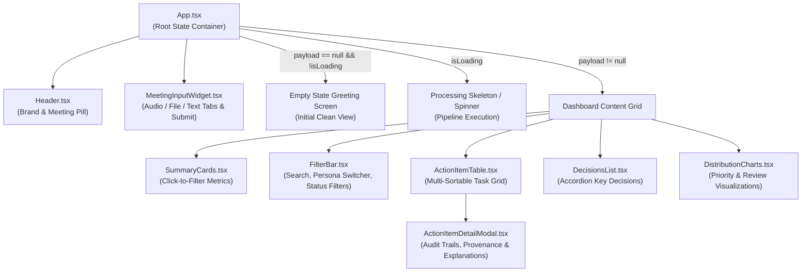
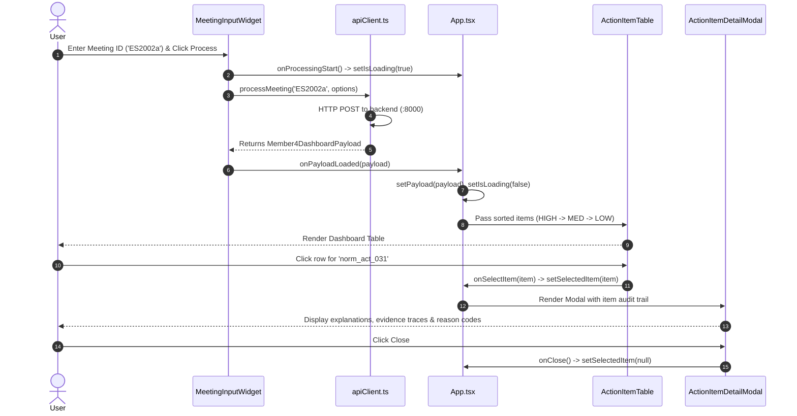

# Meeting Intelligent System — Frontend Architecture & Component Documentation

## 1. Overview & Technology Stack

The presentation layer is an interactive, responsive Single Page Application (SPA) designed to surface meeting intelligence to end-users:

- **Framework**: React 19 (`react`, `react-dom`)
- **Language**: TypeScript (`strict: true`)
- **Bundler & Dev Server**: Vite 6
- **Styling**: Modern Vanilla CSS with design tokens, glassmorphism aesthetics, CSS grid/flexbox, custom animations, and CSS variables in `frontend/src/index.css`.
- **Icons**: `lucide-react`
- **Build Output**: Static assets compiled to `frontend/dist/` via `npm run build`.

---

## 2. Component Hierarchy Diagram

---

## 3. Comprehensive Component Catalog

### 3.1 `App.tsx`
- **File Path**: [`frontend/src/App.tsx`](file:///c:/Users/chaha/OneDrive/Desktop/meeting-intelligent-system/frontend/src/App.tsx)
- **Purpose**: Root application component. Orchestrates global state, handles meeting payload updates, synchronizes persona roles, filters, sorting preferences, and modal selections.
- **Where Rendered**: Root DOM element (`index.html` via `main.tsx`).
- **Parent**: None (`main.tsx`).
- **Child Components**: `Header`, `MeetingInputWidget`, `SummaryCards`, `FilterBar`, `ActionItemTable`, `ActionItemDetailModal`, `DecisionsList`, `DistributionCharts`.
- **Props**: None.
- **State Maintained**:
  - `payload: Member4DashboardPayload | null` (starts `null` for clean empty state).
  - `selectedRole: UserRole` (`MANAGER`, `DEVELOPER`, `INTERN`, `DEFAULT`).
  - `filterText: string` (live text search).
  - `priorityFilter: PriorityLevel | 'ALL'` (`ALL`, `HIGH`, `MEDIUM`, `LOW`).
  - `reviewFilter: ReviewStatus | 'ALL'` (`ALL`, `AUTO_ACCEPT`, `REVIEW_RECOMMENDED`, `REVIEW_REQUIRED`).
  - `prioritySort: 'DESC' | 'ASC' | 'DEFAULT'` (tri-state priority sorting).
  - `selectedItem: CanonicalActionItem | null` (item active in detail modal).
  - `isLoading: boolean` (indicates in-flight API calls).
  - `errorMessage: string | null` (displays user-actionable error banners).
- **Events Handled**:
  - `handlePayloadLoaded(newPayload)`: Updates payload, preserves role, resets active modal.
  - `handleRoleChange(role)`: Switches active persona view.
  - `handleSelectActionItem(item)`: Opens detail modal.
  - `handlePriorityCardClick(level)`: Toggles priority filter when cards are clicked.
- **Data Consumed**: `Member4DashboardPayload` from `MeetingInputWidget`.
- **Data Produced**: Filtered and sorted action items passed down to children.

---

### 3.2 `Header.tsx`
- **File Path**: [`frontend/src/components/Header.tsx`](file:///c:/Users/chaha/OneDrive/Desktop/meeting-intelligent-system/frontend/src/components/Header.tsx)
- **Purpose**: Displays system branding, operational title, clean subtitle (*"Post-Extraction Intelligence & Multi-Perspective Presentation Layer"*), and a dynamic meeting identifier pill.
- **Where Rendered**: Top banner of `App.tsx`.
- **Parent**: `App.tsx`.
- **Child Components**: None (uses `Sparkles`, `Calendar` from `lucide-react`).
- **Props Received**:
  - `meetingId: string` (current meeting ID; empty string when no meeting is loaded).
  - `totalItems: number` (total canonical action items count).
- **State Maintained**: None (pure presentational).
- **Behavioral Logic**: Only renders the meeting pill badge when `meetingId` is non-empty.

---

### 3.3 `MeetingInputWidget.tsx`
- **File Path**: [`frontend/src/components/MeetingInputWidget.tsx`](file:///c:/Users/chaha/OneDrive/Desktop/meeting-intelligent-system/frontend/src/components/MeetingInputWidget.tsx)
- **Purpose**: Provides user input tabs for running meetings through the pipeline. Supports audio file uploads, transcript file uploads (`.txt`, `.json`), and raw pasted dialogue text.
- **Where Rendered**: Below header in `App.tsx`.
- **Parent**: `App.tsx`.
- **Child Components**: None (lucide icons `Upload`, `FileText`, `Mic`, `Play`).
- **Props Received**:
  - `onPayloadLoaded: (payload: Member4DashboardPayload) => void`
  - `onProcessingStart?: () => void`
  - `onProcessingError?: (err: string) => void`
- **State Maintained**:
  - `activeTab: 'audio' | 'transcript_file' | 'transcript_text'` (default `'audio'`).
  - `meetingId: string` (starts clean as `''`).
  - `audioFile: File | null`.
  - `transcriptFile: File | null`.
  - `transcriptText: string`.
  - `isSubmitting: boolean`.
- **API Calls**: Calls `processMeeting()` in `frontend/src/data/apiClient.ts`.
- **Data Produced**: Emits parsed `Member4DashboardPayload` to `App.tsx`.

---

### 3.4 `SummaryCards.tsx`
- **File Path**: [`frontend/src/components/SummaryCards.tsx`](file:///c:/Users/chaha/OneDrive/Desktop/meeting-intelligent-system/frontend/src/components/SummaryCards.tsx)
- **Purpose**: Displays top-level KPI metrics for the currently selected persona view: Total Items, High Priority, Medium Priority, Low Priority, Review Recommended, and Key Decisions.
- **Where Rendered**: Top of the dashboard grid in `App.tsx`.
- **Parent**: `App.tsx`.
- **Props Received**:
  - `view: RolePersonalizedView`
  - `keyDecisionsCount: number`
  - `activePriorityFilter?: PriorityLevel | 'ALL'`
  - `onPriorityCardClick?: (level: PriorityLevel) => void`
- **Interactivity**: Clicking on High, Medium, or Low priority cards toggles filter selection in `App.tsx` with defensive fallback counts.

---

### 3.5 `FilterBar.tsx`
- **File Path**: [`frontend/src/components/FilterBar.tsx`](file:///c:/Users/chaha/OneDrive/Desktop/meeting-intelligent-system/frontend/src/components/FilterBar.tsx)
- **Purpose**: Unified control bar containing:
  - Role switcher buttons (`MANAGER`, `DEVELOPER`, `INTERN`, `DEFAULT`).
  - Text search input (searches tasks, assignees, and reason codes).
  - Priority dropdown filter (`ALL`, `HIGH`, `MEDIUM`, `LOW`).
  - Review status dropdown filter (`ALL`, `AUTO_ACCEPT`, `REVIEW_RECOMMENDED`, `REVIEW_REQUIRED`).
- **Where Rendered**: Directly above `ActionItemTable` in `App.tsx`.
- **Parent**: `App.tsx`.
- **Props Received**:
  - `selectedRole: UserRole`, `onRoleChange: (r: UserRole) => void`
  - `filterText: string`, `onFilterTextChange: (t: string) => void`
  - `priorityFilter: PriorityLevel | 'ALL'`, `onPriorityFilterChange: (p: any) => void`
  - `reviewFilter: ReviewStatus | 'ALL'`, `onReviewFilterChange: (s: any) => void`

---

### 3.6 `ActionItemTable.tsx`
- **File Path**: [`frontend/src/components/ActionItemTable.tsx`](file:///c:/Users/chaha/OneDrive/Desktop/meeting-intelligent-system/frontend/src/components/ActionItemTable.tsx)
- **Purpose**: Displays the list of canonical action items in a sortable, responsive data table.
- **Where Rendered**: Primary dashboard column in `App.tsx`.
- **Parent**: `App.tsx`.
- **Props Received**:
  - `items: CanonicalActionItem[]`
  - `onSelectItem: (item: CanonicalActionItem) => void`
  - `prioritySort: 'DESC' | 'ASC' | 'DEFAULT'`
  - `onTogglePrioritySort: () => void`
- **Sorting Logic**:
  - **Default**: Sorted descending by Priority (`HIGH` $\to$ `MEDIUM` $\to$ `LOW`).
  - Clicking the Priority column header cycles: `DESC` $\to$ `ASC` $\to$ `DEFAULT`.
- **Visual Indicators**:
  - `<Flame />` badge rendered strictly on `HIGH` priority items.
  - Priority badges with distinct colors: High (Red/Coral), Medium (Amber), Low (Emerald/Slate).
  - Review badges: Auto-Accept (Green), Review Recommended (Amber), Review Required (Red).

---

### 3.7 `ActionItemDetailModal.tsx`
- **File Path**: [`frontend/src/components/ActionItemDetailModal.tsx`](file:///c:/Users/chaha/OneDrive/Desktop/meeting-intelligent-system/frontend/src/components/ActionItemDetailModal.tsx)
- **Purpose**: Deep inspection modal providing full audit transparency for an individual action item.
- **Where Rendered**: Modal backdrop overlay in `App.tsx`.
- **Parent**: `App.tsx`.
- **Props Received**:
  - `item: CanonicalActionItem | null`
  - `onClose: () => void`
- **Sections Rendered**:
  - Header: Task title, item ID, assignee, deadline badge.
  - Scores Grid: Priority Score $[0.0 - 1.0]$, Confidence Score $[0.0 - 1.0]$, Review Status.
  - Natural Language Explanations: Priority rationale, confidence rationale, and review rationale.
  - Review Reason Tags: Badges for any triggered triage heuristics (e.g., `AMBIGUOUS_SPEAKER`, `LOW_CONFIDENCE`).
  - Evidence Traces: Verbatim dialogue utterances, speaker attribution, and timestamps.
  - Persona Emphasis: Role-specific guidance notes and multipliers.

---

### 3.8 `DecisionsList.tsx`
- **File Path**: [`frontend/src/components/DecisionsList.tsx`](file:///c:/Users/chaha/OneDrive/Desktop/meeting-intelligent-system/frontend/src/components/DecisionsList.tsx)
- **Purpose**: Accordion-style expandable list of key meeting decisions.
- **Where Rendered**: Secondary column in `App.tsx`.
- **Parent**: `App.tsx`.
- **Props Received**:
  - `decisions: KeyDecision[]`
- **Content Rendered**: Decision text, rationale, approval status badge, and impacted role tags.

---

### 3.9 `DistributionCharts.tsx`
- **File Path**: [`frontend/src/components/DistributionCharts.tsx`](file:///c:/Users/chaha/OneDrive/Desktop/meeting-intelligent-system/frontend/src/components/DistributionCharts.tsx)
- **Purpose**: SVG / CSS-based visual distribution bars showing breakdown of Priority (High vs Medium vs Low) and Review Triage (Auto-Accept vs Recommended vs Required).
- **Where Rendered**: Dashboard sidebar in `App.tsx`.
- **Parent**: `App.tsx`.
- **Props Received**:
  - `view: RolePersonalizedView`

---

## 4. Frontend Data Flow Walkthrough

